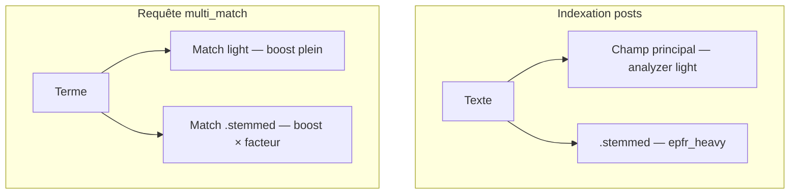

# Algorithme de recherche française

Ce document décrit la chaîne d’analyse et le comportement requête mis en place par
**ElasticPress French Addon**. L’implémentation de référence est
[`includes/class-epfr-analyzer.php`](../includes/class-epfr-analyzer.php).

## Objectifs

Corriger trois faiblesses du mapping ElasticPress par défaut pour le français
(EP ≥ 4, mappings `5-2` / `7-0` et suivants) :

1. **`ep_asciifolding` après `ewp_snowball`** → le stemming travaille sur des formes
   accentuées ; le Snowball French agressif produit des collisions
   (`haine` / `haute` / `fait` vs `haïti`).
2. **Stemmer Snowball non configurable** → trop agressif pour beaucoup de contenus FR.
3. **Pas d’élision** → `l'article`, `d'un`, `qu'il` mal tokenisés.

On s’aligne sur l’analyzer `french` officiel Elasticsearch (élision → lowercase → stop →
`keyword_marker` → stemmer `light_french`), puis on **ajoute** volontairement
`asciifolding` **après** les stopwords (pour que `_french_` voie encore les formes
accentuées) et **avant** le stemming.

## Vue d’ensemble

```mermaid
flowchart LR
  text[Texte indexé / requête] --> tok[tokenizer standard]
  tok --> elision[epfr_elision]
  elision --> lower[lowercase]
  lower --> stop[ep_stop + epfr_extra_stop]
  stop --> ascii[asciifolding]
  ascii --> syn[filtres tiers EP / synonymes]
  syn --> kw[epfr_keywords]
  kw --> stem[epfr_stemmer]
  stem --> tokens[Tokens]
```



Ordre réel reconstruit par `build_analyzer()` (mode **full**, réglages par défaut) :

| Étape | Filtre | Rôle |
|---|---|---|
| 1 | `epfr_elision` | Retire les articles élidés (`l'`, `d'`, `qu'`, …) |
| 2 | `lowercase` | Normalise la casse |
| 3 | `ep_stop` (+ `epfr_extra_stop`) | Stopwords `_french_` puis liste admin optionnelle |
| 4 | `asciifolding` | Replie accents / ligatures (`ï`→`i`, `œ`→`oe`) ; remplace `ep_asciifolding` |
| 5 | *(filtres ElasticPress déjà présents)* | Synonymes, shingles, etc. — **jamais retirés** |
| 6 | `epfr_keywords` | Marque les mots exclus du stemming (`stem_exclusion`) |
| 7 | `epfr_stemmer` | Racinisation (`light_french` par défaut) |

Le stemmer Snowball / native déjà présent dans la chaîne EP est **retiré**, puis remplacé
par `epfr_stemmer` si un niveau de stemming est choisi. `ep_asciifolding` est également
retiré lorsque notre `asciifolding` est actif (voir ci-dessous).

## Détail des leviers

### Élision (`elision`)

Filtre ES `elision` avec `articles_case: true` et la liste :

`l`, `m`, `t`, `qu`, `n`, `s`, `j`, `d`, `c`, `jusqu`, `quoiqu`, `lorsqu`, `puisqu`

Placé **en tête** de chaîne (comme l’analyzer `french` officiel), avant `lowercase`.

### Asciifolding (`asciifolding`)

ElasticPress définit un filtre nommé `ep_asciifolding` :

```json
{ "type": "asciifolding", "preserve_original": true }
```

Avec `preserve_original`, chaque token accentué produit **deux** formes (`café` →
`café` + `cafe`). Le filtre natif `asciifolding` (celui que cet addon injecte)
remplace au contraire la forme accentuée : une seule forme ASCII reste dans le flux.

L’addon retire donc `ep_asciifolding` et insère `asciifolding` **après** `ep_stop`
(et `epfr_extra_stop` le cas échéant), avant les filtres tiers et le stemming — pour
éviter le double token et pour que accents et racinisation travaillent correctement
ensemble. Si l’option est désactivée, les filtres `asciifolding` / `ep_asciifolding`
éventuellement présents sont retirés.

Placer le folding *avant* les stopwords casserait la liste `_french_` (formes
accentuées : `même`, `était`, `où`…) : les tokens arriveraient déjà repliés et ne
seraient plus filtrés.

Effet attendu : `Haïti`, `haïti`, `haiti` → même token (modulo stemming).

### Stopwords

- Base : filtre ElasticPress `ep_stop` forcé en `_french_` via `ep_analyzer_language`
  (contexte `filter_ep_stop` uniquement).
- Optionnel : `epfr_extra_stop` (liste CSV admin, `ignore_case: true`), ajouté **après**
  `ep_stop` et **avant** `asciifolding`.

### Exclusion de stemming (`stem_exclusion`)

Filtre `keyword_marker` (`epfr_keywords`) **immédiatement avant** le stemmer.
Les mots listés ne sont pas racinisés — utile pour éviter `croix` → collision avec
`croissant`. Non enregistré si la liste est vide ou si `stemmer=none` (piège ES classique).

### Stemmer (`stemmer`)

| Valeur | Comportement |
|---|---|
| `none` | Pas de stemming (ni `epfr_stemmer`, ni `epfr_keywords`) |
| `minimal_french` | Très doux |
| `light_french` | **Défaut** — bon compromis pertinence / rappel |
| `french` | Plus agressif |

### Fuzziness (temps de requête)

Filtres `ep_post_fuzziness_arg` et `ep_post_match_fuzziness` : force `auto`, `0`, `1`
ou `2` selon le réglage. Indépendant du mapping ; **pas** besoin de `--setup` pour
changer uniquement la fuzziness, mais tester sur un jeu de requêtes reste recommandé.

### Stopwords français forcés

Tant que l’addon est activé, `ep_analyzer_language` ne force que le contexte
`filter_ep_stop` vers `_french_`. Les autres contextes (snowball EP, clé `language`
d’analyzer custom) sont laissés inchangés : notre chaîne retire déjà `ewp_snowball`.

## Mode dual (opt-in)

Réglage `dual_analyzers` (défaut `false`). Actif seulement si l’addon est enabled **et**
`stemmer !== none`.

**Périmètre : index posts uniquement.** Sur terms / comments / users, `default` /
`default_search` restent en chaîne **full** (stemming conservé) ; `epfr_heavy` et les
multi-fields `.stemmed` ne sont pas ajoutés.

| Surface | Analyzer | But |
|---|---|---|
| Champs principaux posts (`post_title`, `post_content`, `post_excerpt`) | chaîne **light** (sans keywords / stemmer) | Précision / ranking |
| Multi-fields `.stemmed` (posts) | analyzer nommé `epfr_heavy` (chaîne **full**) | Rappel (formes fléchies) |

À l’indexation (`ep_post_mapping`) : ajout de
`post_*.fields.stemmed` avec `"analyzer": "epfr_heavy"`. L’enregistrement des analyzers
est confié à `ep_config_mapping`.

À la requête (`ep_formatted_args`, priorité **25**, après le weighting EP en prio 20) :

- parcours récursif des clauses ;
- pour chaque `multi_match` **sauf** `cross_fields` (analyzers hétérogènes incompatibles),
  ajout de `post_title.stemmed`, `post_content.stemmed`, `post_excerpt.stemmed` ;
- boost = boost parent × facteur (défaut **0.5**, filtrable via `epfr_stemmed_boost_factor`).

Sans cette injection post-weighting, ElasticPress reconstruirait la liste des champs et
supprimerait les `.stemmed` inconnus.



## Intégration ElasticPress

| Filtre | Rôle |
|---|---|
| `ep_config_mapping` | Construit filtres + analyzers `default` / `default_search` (+ `epfr_heavy` sur l’index posts en dual) |
| `ep_post_mapping` | Multi-fields `.stemmed` en mode dual |
| `ep_formatted_args` (25) | Injecte `.stemmed` dans les `multi_match` |
| `ep_analyzer_language` | Force `_french_` pour `filter_ep_stop` |
| `ep_post_fuzziness_arg` / `ep_post_match_fuzziness` | Fuzziness admin |
| `epfr_mapping` | Hook projet pour ajustements avancés (`stemmer_override`, etc.) |
| `epfr_stemmed_boost_factor` | Facteur de boost des champs `.stemmed` (défaut `0.5`) |

Les filtres déjà présents (synonymes EP, shingles DidYouMean, …) sont **conservés** :
l’addon ajoute ou remplace uniquement sa propre chaîne stemmer / folding / élision.

## Réglages par défaut

Voir `Settings::get_defaults()` :

| Clé | Défaut |
|---|---|
| `enabled` | `true` |
| `asciifolding` | `true` |
| `elision` | `true` |
| `stemmer` | `light_french` |
| `fuzziness` | `auto` |
| `extra_stopwords` | `''` |
| `stem_exclusion` | `''` |
| `dual_analyzers` | `false` |

## Contrainte opérationnelle

Toute modification de mapping / analyzer exige une **réindexation complète**
(`wp elasticpress index --setup`). Un sync sans `--setup` ne recrée pas l’index et laisse
l’ancien mapping en place.

## Vérification rapide

```bash
curl -s 'http://YOUR_CLUSTER:9200/YOUR_INDEX/_analyze' \
  -H 'Content-Type: application/json' \
  -d '{"analyzer":"default","text":"Haïti haïti haiti haine haute fait"}'
```

Attendu avec les défauts : les trois formes « Haïti » partagent le même token ; `haine`,
`haute`, `fait` ne doivent plus collapser vers une racine proche de `haiti`.

Scripts locaux utiles : `ddev composer verify:options`, `verify:corpus`, `compare:corpus`.
Tests unitaires (chaîne `build_analyzer`, injection query `.stemmed`, fuzziness) : `composer test`.

## Références

1. [Language analyzers (Elastic)](https://www.elastic.co/docs/reference/text-analysis/analysis-lang-analyzer)
2. [Construire un bon analyzer français (JoliCode)](https://jolicode.com/blog/construire-un-bon-analyzer-francais-pour-elasticsearch)
3. [Leviers Elasticsearch — spécificités linguistiques](https://www.elastic.co/fr/blog/leviers-elasticsearch-pour-le-traitement-des-specificites-linguistiques)
